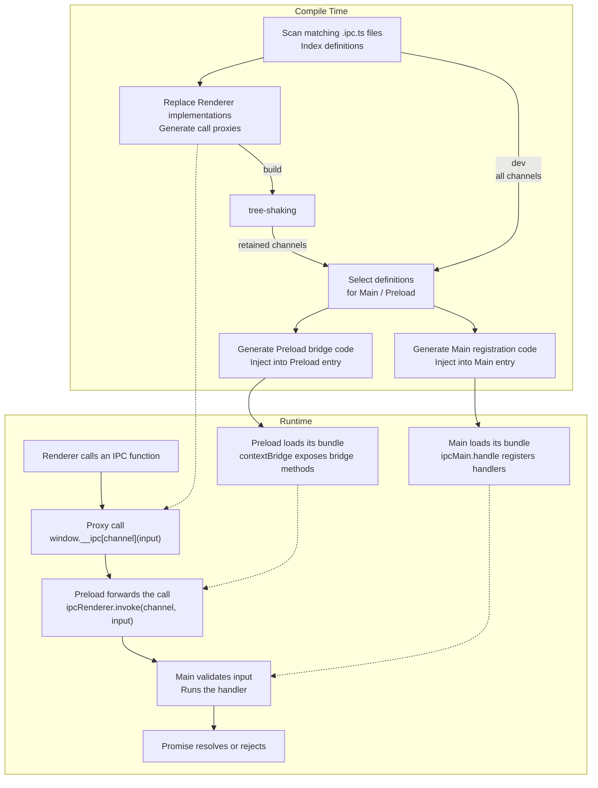

# electron-ipc-invoke

[简体中文](README.zh-CN.md)

Define a function once and call it across processes with type safety. Built on Electron's native `invoke`/`handle` APIs, the Vite plugins generate handler registration and preload bridges, with parameter and return types inferred from the definition. No handwritten IPC boilerplate or type declarations are required. Inspired by TanStack Start's `createServerFn`.

## Installation

```bash
npm install electron-ipc-invoke
```

## Example

The [`examples/`](./examples) directory contains two minimal projects using Vite, Electron, Zod schemas, and React:

- [`vite-plugin-electron`](./examples/vite-plugin-electron): uses `vite-plugin-electron/simple` with separate main/preload builds.
- [`vite-plugin-electron-multi-env`](./examples/vite-plugin-electron-multi-env): uses `electronSimple` from `vite-plugin-electron/multi-env` with Vite environments.

## Quick Start

### 1. Add the Vite plugins

Add the corresponding plugin to each renderer, main, and preload build:

```ts
// vite.config.ts
import { defineConfig } from "vite"
import electron from "vite-plugin-electron/simple"
import { ipcInvoke } from "electron-ipc-invoke/vite"

export default defineConfig(() => {
    const [renderer, main, preload] = ipcInvoke()

    return {
        plugins: [
            renderer,
            electron({
                main: {
                    entry: "electron/main.ts",
                    vite: { plugins: [main] },
                },
                preload: {
                    input: "electron/preload.ts",
                    vite: { plugins: [preload] },
                },
            }),
        ],
    }
})
```

### 2. Define a function with `createIpcInvoke` in an `.ipc.ts` file

```ts
// electron/custom.ipc.ts
import { app } from "electron"
import { z } from "zod"
import { createIpcInvoke } from "electron-ipc-invoke"

export const getVersion = createIpcInvoke("channel")
    .inputValidator(z.object({ prefix: z.string() }))
    .handler(({ event, data }) => {
        // event: IpcMainInvokeEvent | undefined
        // data: { prefix: string }
        return data.prefix + app.getVersion()
    })
```

### 3. Call the function from the renderer

```ts
// src/App.tsx
import { getVersion } from "../electron/custom.ipc"

// The parameter type is inferred from the schema; the return type is inferred from the handler.
const version = await getVersion({ prefix: "v" }) // string
```

## How It Works

The build plugins process functions defined with `createIpcInvoke` differently for each build target. The core behavior is illustrated below:

```ts
// renderer: replace the function with a call to the bridge on window.
// Remove the rest of the implementation and its runtime dependencies.
// Types come from the original TypeScript signature, so importing the same function provides both type inference and IPC calls.
export const getVersion = async (input) => globalThis.__ipc["channel"](input)

// preload: inject generated bridge code into the preload entry.
contextBridge.exposeInMainWorld("__ipc", {
    ["channel"]: (input) => ipcRenderer.invoke("channel", input),
})

// main: inject generated registration code into the main entry.
// execute is the definition's internal entry point: it validates input, then runs the handler.
ipcMain.handle("channel", (event, input) => execute(event, input))
```



## API

### `createIpcInvoke(channel).inputValidator(schema).handler(fn)`

| Parameter | Description |
| --------- | ----------- |
| `channel` | IPC channel. Must be a string literal containing at least one non-whitespace character and be unique across all scanned definitions. |
| `schema` | A schema that implements [StandardSchemaV1](https://github.com/standard-schema/standard-schema), such as a Zod schema. Validation runs in main and supports synchronous or asynchronous validation and transformations. |
| `fn` | A synchronous or asynchronous handler that receives `{ event, data }`. |
| `event` | The `IpcMainInvokeEvent` when called from the renderer, or `undefined` when called directly from main. |
| `data` | The schema's validated output. When `.inputValidator(schema)` is omitted, as in `createIpcInvoke(channel).handler(fn)`, `data` is `undefined`. |

With `.inputValidator(schema)`, the returned function's parameter type is `StandardSchemaV1.InferInput<typeof schema>`. Without it, no argument is required. The return type is `Promise<Awaited<ReturnType<typeof fn>>>`.

When calling from the renderer, arguments and return values must follow the transport rules of [Electron IPC](https://www.electronjs.org/docs/latest/api/ipc-renderer#ipcrendererinvokechannel-args) and [`contextBridge`](https://www.electronjs.org/docs/latest/api/context-bridge#parameter--error--return-type-support).

When calling from main, the function validates input and executes `fn` directly, without IPC. It always returns a Promise.

| Calling environment | Execution path | Handler's `event` |
| ------------------- | -------------- | ----------------- |
| renderer | preload → IPC → validation in main → handler | The `IpcMainInvokeEvent` for this call |
| main | validation in main → handler | `undefined` |

### `ipcInvoke(options?)`

Returns a tuple of plugin instances in `[renderer, main, preload]` order. Add each plugin to its corresponding build.

All three targets must use plugins returned by the same `ipcInvoke()` call and share the same definition root. In development, initialize the renderer before starting the main/preload builds. In production, complete the renderer build before building main/preload so they can use the channels retained in the renderer output.

| Option | Default | Description |
| ------ | ------- | ----------- |
| `include` | `['**/*.ipc.ts']` | Definition file globs relative to `root`. Must cover the paths where your `.ipc.ts` files are stored. |
| `exclude` | `[]` | Additional exclusion patterns relative to `root`. The `node_modules`, `.git`, `dist`, and `dist-electron` directories are always excluded. |
| `root` | Vite root | The shared definition root for all three targets. |
| `bridgeName` | `'__ipc'` | The global bridge property name in the renderer. |

`include` and `exclude` do not support absolute paths, `..` path segments, or patterns starting with `!`. Put exclusion patterns in `exclude`.

## Usage Notes

`.ipc.ts` files may only export IPC definitions and types. IPC definitions must directly export the complete call chain using a top-level `export const`. Default runtime exports, runtime re-exports, and other runtime exports are not supported. Export constants, schemas, and helper functions from separate modules if they need to be shared.
