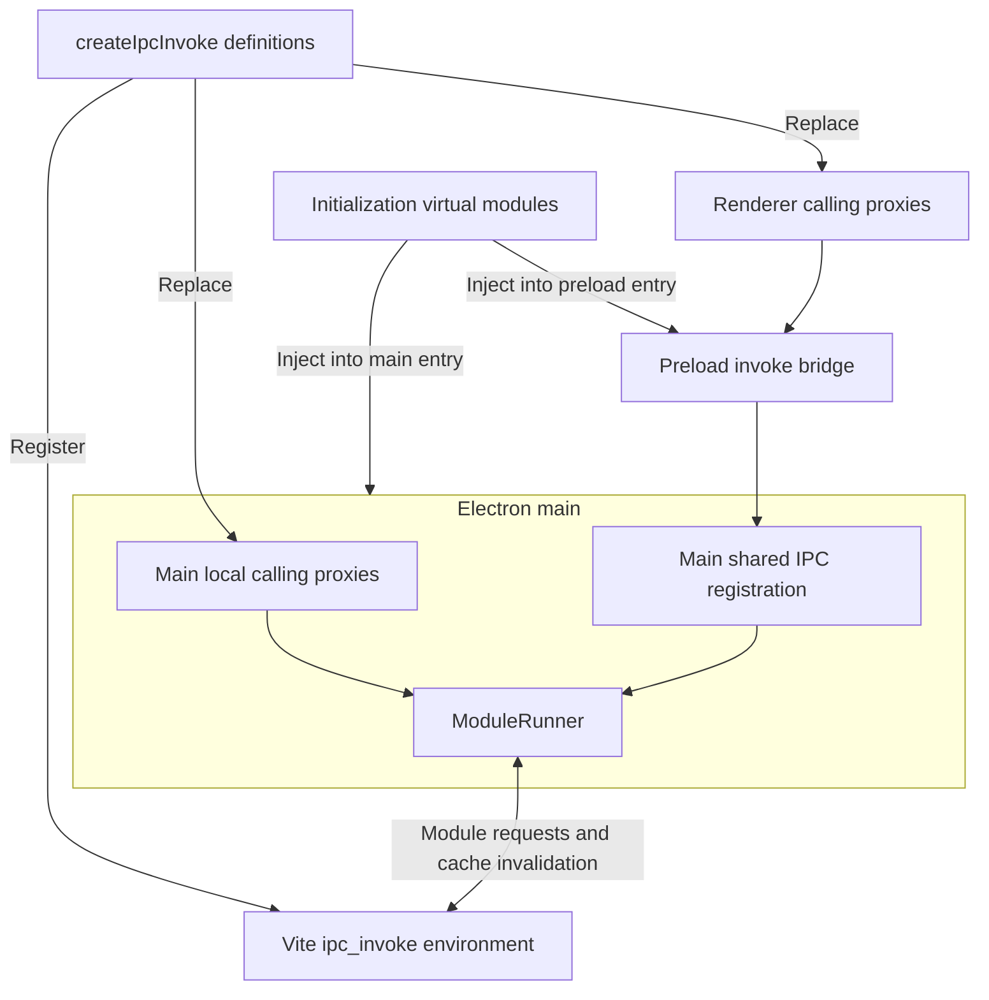
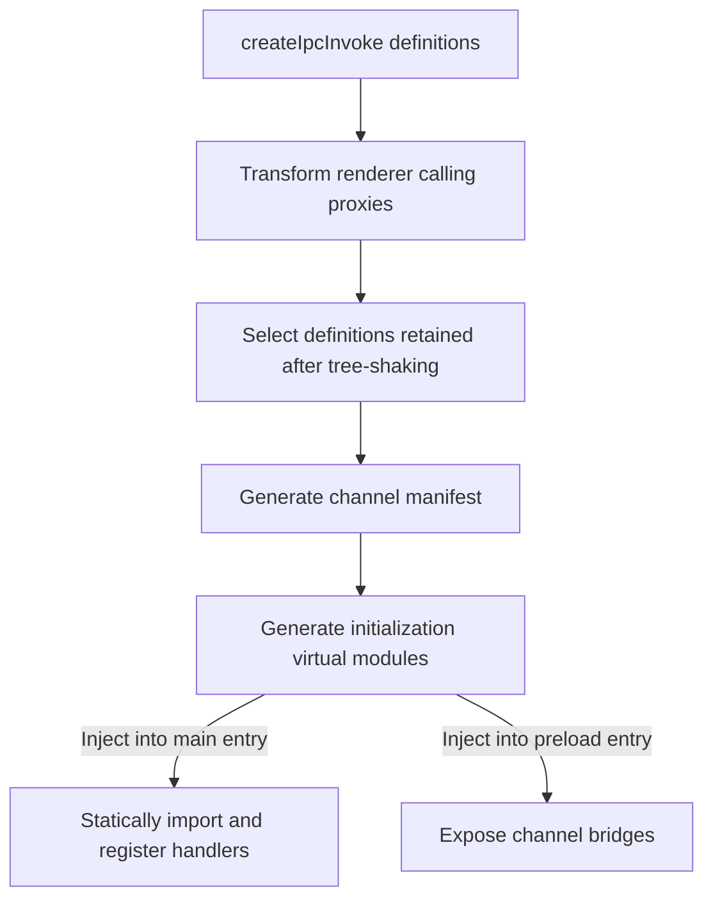

# electron-ipc-invoke

[简体中文](README.zh-CN.md)

Define a function once and call it across processes with type safety. Built on Electron's native `invoke`/`handle` APIs, the Vite plugins generate handler registration and preload bridges, with parameter and return types inferred from the definition. No handwritten IPC boilerplate or type declarations are required. Inspired by TanStack Start's `createServerFn`.

During development, changes to functions defined with `createIpcInvoke` take effect on the next call, without restarting the Electron main process.

## Installation

```bash
npm install electron-ipc-invoke
```

## Example

The [`examples/`](./examples) directory contains two minimal projects using Vite, Electron, Zod schemas, and React:

- [`vite-plugin-electron`](./examples/vite-plugin-electron): uses `vite-plugin-electron/simple` with separate main/preload builds.
- [`vite-plugin-electron-multi-env`](./examples/vite-plugin-electron-multi-env): uses `electronSimple` from `vite-plugin-electron/multi-env` with Vite environments.

## Quick Start

### 1. Add the Vite plugins

Add the corresponding plugins to the renderer, main, and preload builds:

```ts
// vite.config.ts
import { defineConfig } from "vite"
import electron from "vite-plugin-electron/simple"
import { ipcInvoke } from "electron-ipc-invoke/vite"

export default defineConfig(() => {
    const [renderer, main, preload] = ipcInvoke()

    return {
        plugins: [
            renderer,
            electron({
                main: {
                    entry: "electron/main.ts",
                    vite: { plugins: [main] },
                },
                preload: {
                    input: "electron/preload.ts",
                    vite: { plugins: [preload] },
                },
            }),
        ],
    }
})
```

### 2. Define a function with `createIpcInvoke`

```ts
// electron/custom.ts
import { z } from "zod"
import { createIpcInvoke } from "electron-ipc-invoke"

export const greet = createIpcInvoke("greet")
    .inputValidator(z.object({ name: z.string() }))
    .handler(({ event, data }) => {
        // event: IpcMainInvokeEvent | undefined
        // data: { name: string }
        return `Hello, ${data.name}!`
    })
```

### 3. Call the function from the renderer

```tsx
// src/App.tsx
import { greet } from "../electron/custom"

export default function App() {
    async function sayHello() {
        // The parameter type is inferred from the schema; the return type is inferred from the handler.
        // greet: ({ name: string }) => Promise<string>
        const message = await greet({ name: "Electron" })
        console.log(message) // "Hello, Electron!"
    }

    return <button onClick={sayHello}>Say hello</button>
}
```

## How It Works

The plugins transform functions defined with `createIpcInvoke` for each environment and inject initialization code into main and preload entries through virtual modules. Dev proxies identify functions by module path and export name; the runtime loads updated modules on demand. Build generates handler registration and bridge code from the channel manifest after tree-shaking.

### Dev

`electron-ipc-invoke/dev` exports only `initRuntime` and `getRuntime`. The plugins initialize the shared instance in main, use it for local calls and renderer IPC dispatch, and close it with `(await getRuntime()).close()` on quit. Closing is idempotent; the closed instance remains cached and rejects further invocations. Application code does not need to manage this lifecycle.



### Build



## API

### `createIpcInvoke(channel).inputValidator(schema).handler(fn)`

#### Parameters

| Property | Type | Description |
| -------- | ---- | ----------- |
| `channel` | `string` | IPC channel. Must be a unique, non-blank string literal. |
| `schema` | [`StandardSchemaV1`](https://github.com/standard-schema/standard-schema) | A schema implementing `StandardSchemaV1`, such as Zod. Omit `.inputValidator(schema)` to use `createIpcInvoke(channel).handler(fn)` directly. |
| `fn` | `(context: { event: `[`IpcMainInvokeEvent`](https://www.electronjs.org/docs/latest/api/structures/ipc-main-invoke-event)` \| undefined, data: Data }) => Result` | `event`: the IPC event for a renderer call, or `undefined` for a main call.<br>`Data`: the schema output type, or `undefined` when `.inputValidator(schema)` is omitted. |

#### Returns

| Type | Description |
| ---- | ----------- |
| `(input: Input) => Promise<Awaited<Result>>` | Callable from renderer/main.<br>`Input`: the schema input type; no argument is required when `.inputValidator(schema)` is omitted.<br>For renderer calls, arguments and return values must follow the transport rules of [Electron IPC](https://www.electronjs.org/docs/latest/api/ipc-renderer#ipcrendererinvokechannel-args) and [`contextBridge`](https://www.electronjs.org/docs/latest/api/context-bridge#parameter--error--return-type-support). |

### `ipcInvoke(options?)`

#### Parameters

| Property | Type | Default | Description |
| -------- | ---- | ------- | ----------- |
| `options.bridgeName` | `string` | `'__ipc'` | The global bridge property name in the renderer. Must contain a non-whitespace character. |

#### Returns

| Type | Description |
| ---- | ----------- |
| `[renderer: Plugin[], main: Plugin[], preload: Plugin[]]` | A tuple of Vite plugin arrays. |

## ⚠️ Notes

- **When a module uses `createIpcInvoke` to define and export functions, it may export only those functions and types.**
- During development, IPC handlers are not guaranteed to share module-level variables or objects with ordinary modules imported directly by main.
