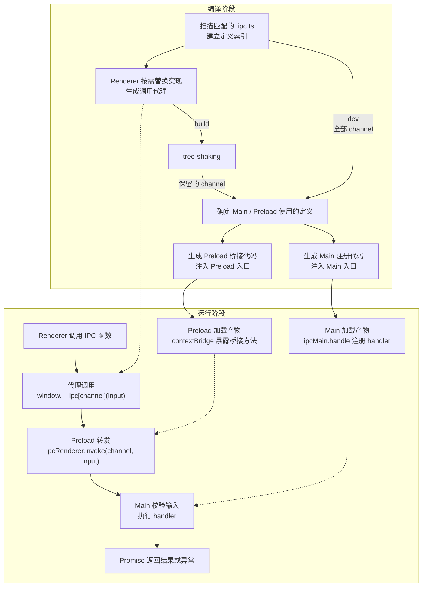

# electron-ipc-invoke

[English](README.md)

只需定义一次函数，即可进行类型安全的跨进程调用：基于 Electron 原生 invoke/handle，通过构建插件自动生成注册和桥接、推导参数和返回类型，无需手写 IPC 样板代码及类型声明。设计灵感来自 TanStack Start 的 `createServerFn`。

## 安装

```bash
npm install electron-ipc-invoke
```

## 示例

[`examples/`](./examples) 中提供了两个使用 Vite、Electron、Zod schema 和 React 的最小项目：

- [`vite-plugin-electron`](./examples/vite-plugin-electron)：使用 `vite-plugin-electron/simple`，分别构建 main 和 preload。
- [`vite-plugin-electron-multi-env`](./examples/vite-plugin-electron-multi-env)：使用 `vite-plugin-electron/multi-env` 导出的 `electronSimple`，通过 Vite environments 构建。

## 快速开始

### 1. 添加 Vite 插件

分别把三个目标插件接入 renderer、main 和 preload 构建：

```ts
// vite.config.ts
import { defineConfig } from "vite"
import electron from "vite-plugin-electron/simple"
import { ipcInvoke } from "electron-ipc-invoke/vite"

export default defineConfig(() => {
    const [renderer, main, preload] = ipcInvoke()

    return {
        plugins: [
            renderer,
            electron({
                main: {
                    entry: "electron/main.ts",
                    vite: { plugins: [main] },
                },
                preload: {
                    input: "electron/preload.ts",
                    vite: { plugins: [preload] },
                },
            }),
        ],
    }
})
```

### 2. 在 `.ipc.ts` 文件中使用 `createIpcInvoke` 定义函数

```ts
// electron/custom.ipc.ts
import { app } from "electron"
import { z } from "zod"
import { createIpcInvoke } from "electron-ipc-invoke"

export const getVersion = createIpcInvoke("channel")
    .inputValidator(z.object({ prefix: z.string() }))
    .handler(({ event, data }) => {
        // event: IpcMainInvokeEvent | undefined
        // data: { prefix: string }
        return data.prefix + app.getVersion()
    })
```

### 3. 在 renderer 调用函数

```ts
// src/App.tsx
import { getVersion } from "../electron/custom.ipc"

// 参数由 schema 推导，返回类型由 handler 推导
const version = await getVersion({ prefix: "v" }) // string
```

## 工作原理

构建插件把通过 `createIpcInvoke` 定义的函数，在三个构建环境中分别做不同处理。核心逻辑如下：

```ts
// renderer：被定义的函数会被替换为 window 调用，其余实现及运行时依赖都会被移除
// 类型来自原始定义的 TypeScript 签名；因此导入同一函数即可同时获得类型推导和 IPC 调用能力。
export const getVersion = async (input) => globalThis.__ipc["channel"](input)

// preload：插件自动在 preload 入口文件注入桥接代码
contextBridge.exposeInMainWorld("__ipc", {
    ["channel"]: (input) => ipcRenderer.invoke("channel", input),
})

// main：插件自动在 main 入口文件注入注册代码
ipcMain.handle("channel", (event, input) => execute(event, input))
```



## API

### `createIpcInvoke(channel).inputValidator(schema).handler(fn)`

| 参数      | 说明                                                                                                                                               |
| --------- | -------------------------------------------------------------------------------------------------------------------------------------------------- |
| `channel` | IPC channel，必须是包含非空白字符的字符串字面量，且在扫描范围内唯一 |
| `schema`  | 任何实现 [StandardSchemaV1](https://github.com/standard-schema/standard-schema) 规范的schema，例如 `zod`。 在 main 中进行验证，支持同步/异步验证和转换 |
| `fn`      | 同步或异步 handler，接收 `{ event, data }`                                                                                                         |
| `event`   | renderer 调用时为 `IpcMainInvokeEvent`，main 调用时为 `undefined`                                                                                  |
| `data`    | schema 校验后的输出，没有 inputValidator 即 createIpcInvoke(channel).handler(fn) 时为 `undefined`                                                  |

使用 `.inputValidator(schema)` 时，返回函数的参数类型为 `StandardSchemaV1.InferInput<typeof schema>`；省略时无需传参。返回类型为 `Promise<Awaited<ReturnType<typeof fn>>>`。

在 renderer 中调用时，参数和返回值必须符合 [Electron IPC](https://www.electronjs.org/docs/latest/api/ipc-renderer#ipcrendererinvokechannel-args) 与 [`contextBridge`](https://www.electronjs.org/docs/latest/api/context-bridge#parameter--error--return-type-support) 的传输规则。

在 main 中调用时会直接校验然后执行 `fn`，不经过 IPC，始终返回 Promise。

| 调用环境 | 执行路径                            | handler 的 `event`              |
| -------- | ----------------------------------- | ------------------------------- |
| renderer | preload → IPC → main 校验 → handler | 本次调用的 `IpcMainInvokeEvent` |
| main     | main 校验 → handler                 | `undefined`                     |

### `ipcInvoke(options?)`

返回按 `[renderer, main, preload]` 顺序排列的插件实例元组，分别接入对应构建。
三个目标必须使用同一次 `ipcInvoke()` 调用返回的插件并共享定义根目录。开发时应先初始化 renderer，再启动 main/preload 构建；生产构建时必须先完成 renderer 构建，再构建 main/preload，以便使用 renderer 产物中保留的 channel。

| 选项         | 默认值            | 说明                                                                                         |
| ------------ | ----------------- | -------------------------------------------------------------------------------------------- |
| `include`    | `['**/*.ipc.ts']` | 相对于 `root` 的定义文件 glob，需覆盖实际存放 `.ipc.ts` 文件的路径                           |
| `exclude`    | `[]`              | 相对于 `root` 的额外排除规则，`node_modules`、`.git`、`dist` 和 `dist-electron` 目录始终排除 |
| `root`       | Vite root         | 三个目标共用的定义根目录                                                                     |
| `bridgeName` | `'__ipc'`         | renderer 中的全局桥接属性名                                                                  |

`include` 和 `exclude` 不支持绝对路径、`..` 路径段或以 `!` 开头的模式；排除规则请写入 `exclude`。

## 注意事项

`.ipc.ts` 文件只允许导出 IPC 定义和类型。IPC 定义必须通过顶层 `export const` 直接导出完整调用链；不支持默认运行时导出、运行时重导出或其他运行时导出。常量、schema 和辅助函数如需导出，应放在其他模块中。
