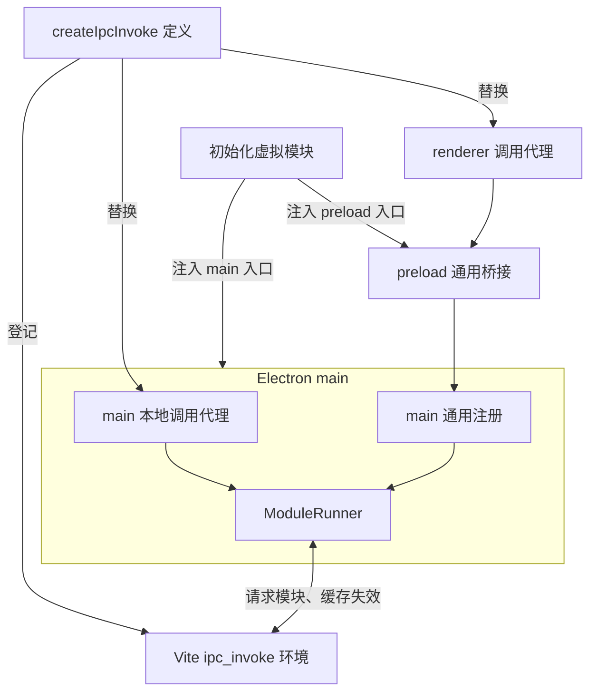
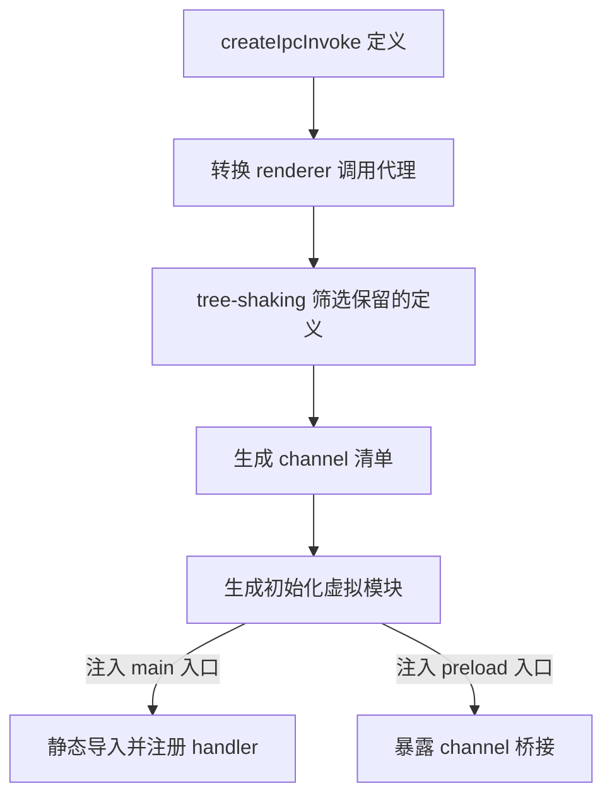

# electron-ipc-invoke

[English](README.md)

只需定义一次函数，即可进行类型安全的跨进程调用：基于 Electron 原生 invoke/handle，通过插件自动生成注册和桥接、推导参数和返回类型，无需手写 IPC 样板代码及类型声明。设计灵感来自 TanStack Start 的 `createServerFn`。

开发时，修改 `createIpcInvoke` 定义的函数会在下次调用时生效，无需重启 Electron 主进程。

## 安装

```bash
npm install electron-ipc-invoke
```

## 示例

[`examples/`](./examples) 中提供了两个使用 Vite、Electron、Zod schema 和 React 的最小项目：

- [`vite-plugin-electron`](./examples/vite-plugin-electron)：使用 `vite-plugin-electron/simple`，分别构建 main 和 preload。
- [`vite-plugin-electron-multi-env`](./examples/vite-plugin-electron-multi-env)：使用 `vite-plugin-electron/multi-env` 导出的 `electronSimple`，通过 Vite environments 构建。

## 快速开始

### 1. 添加 Vite 插件

分别把对应插件接入 renderer、main 和 preload 构建：

```ts
// vite.config.ts
import { defineConfig } from "vite"
import electron from "vite-plugin-electron/simple"
import { ipcInvoke } from "electron-ipc-invoke/vite"

export default defineConfig(() => {
    const [renderer, main, preload] = ipcInvoke()

    return {
        plugins: [
            renderer,
            electron({
                main: {
                    entry: "electron/main.ts",
                    vite: { plugins: [main] },
                },
                preload: {
                    input: "electron/preload.ts",
                    vite: { plugins: [preload] },
                },
            }),
        ],
    }
})
```

### 2. 使用 `createIpcInvoke` 定义函数

```ts
// electron/custom.ts
import { z } from "zod"
import { createIpcInvoke } from "electron-ipc-invoke"

export const greet = createIpcInvoke("greet")
    .inputValidator(z.object({ name: z.string() }))
    .handler(({ event, data }) => {
        // event: IpcMainInvokeEvent | undefined
        // data: { name: string }
        return `Hello, ${data.name}!`
    })
```

### 3. 在 renderer 调用函数

```tsx
// src/App.tsx
import { greet } from "../electron/custom"

export default function App() {
    async function sayHello() {
        // 参数由 schema 推导，返回类型由 handler 推导
        // greet: ({ name: string }) => Promise<string>
        const message = await greet({ name: "Electron" })
        console.log(message) // "Hello, Electron!"
    }

    return <button onClick={sayHello}>hello</button>
}
```

## 工作原理

插件会根据运行环境转换 `createIpcInvoke` 定义的函数，并通过虚拟模块向 main 和 preload 入口注入初始化代码。dev 代理通过模块路径和导出名定位函数，运行时按需加载更新后的模块；build 根据 tree-shaking 后的 channel 清单生成注册和桥接代码。

### Dev

`electron-ipc-invoke/dev` 仅导出 `initRuntime` 和 `getRuntime`。插件在 main 中初始化共享实例，用它处理本地调用与 renderer IPC 分发，并在退出时通过 `(await getRuntime()).close()` 关闭。重复关闭只清理一次；关闭后的实例仍保留在缓存中，并拒绝后续调用。业务代码无需管理这套生命周期。



### Build



## API

### `createIpcInvoke(channel).inputValidator(schema).handler(fn)`

#### Parameters

| 属性 | 类型 | 说明 |
| ---- | ---- | ---- |
| `channel` | `string` | IPC channel，须为唯一的非空白字符串字面量 |
| `schema` | [`StandardSchemaV1`](https://github.com/standard-schema/standard-schema) | 实现 `StandardSchemaV1` 的 schema，例如 Zod。可省略 `.inputValidator(schema)`，直接使用 `createIpcInvoke(channel).handler(fn)` |
| `fn` | `(context: { event: `[`IpcMainInvokeEvent`](https://www.electronjs.org/docs/latest/api/structures/ipc-main-invoke-event)` \| undefined, data: Data }) => Result` | `event`：renderer 调用对应的 IPC 事件；main 调用时为 `undefined`<br>`Data`：schema 输出类型；省略 `.inputValidator(schema)` 时为 `undefined` |

#### Returns

| 类型 | 说明 |
| ---- | ---- |
| `(input: Input) => Promise<Awaited<Result>>` | 支持 renderer/main 调用<br>`Input`：schema 输入类型；省略 `.inputValidator(schema)` 时无需传参<br>renderer 调用时，参数和返回值须符合 [Electron IPC](https://www.electronjs.org/docs/latest/api/ipc-renderer#ipcrendererinvokechannel-args) 与 [`contextBridge`](https://www.electronjs.org/docs/latest/api/context-bridge#parameter--error--return-type-support) 的传输规则 |

### `ipcInvoke(options?)`

#### Parameters

| 属性 | 类型 | 默认值 | 说明 |
| ---- | ---- | ------ | ---- |
| `options.bridgeName` | `string` | `'__ipc'` | renderer 中的全局桥接属性名，须包含非空白字符 |

#### Returns

| 类型 | 说明 |
| ---- | ---- |
| `[renderer: Plugin[], main: Plugin[], preload: Plugin[]]` | Vite 插件元组 |

## ⚠️ 注意

- **在模块中使用 `createIpcInvoke` 定义并导出函数时，该模块只允许导出这类函数和类型。**
- 开发时，IPC handler 与 main 中直接导入的普通模块，不保证共享模块级变量或对象。
